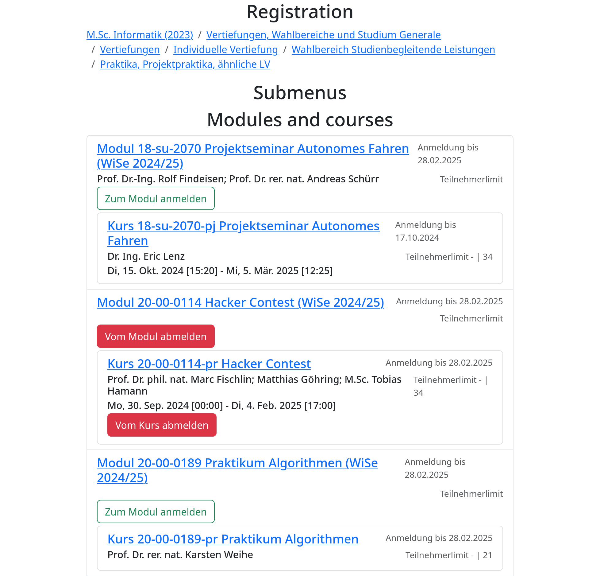

# tucant

## How does it work

This software consists of the tucan-connector component that extracts information from the html of [TUCaN](https://www.tucan.tu-darmstadt.de) and provides it as a nicer to use programming API. The tucan-injector component can then be used to show that data with a nicer UI that is written using the Rust frontend library [Yew](https://yew.rs/) and that is compiled to [WebAssembly](https://webassembly.org/). This WebAssembly can be injected into the actual TUCaN website using [Tampermonkey](https://www.tampermonkey.net/). Then, some pages provide an overlay with the information in a nicer format and caching.

## Features

Currently, the following TUCaN pages have a nicer UI and caching:
- Veranstaltungen -> Anmeldung
  
  

## Usage

Install Tampermonkey, go to Utilities tab and import from url
https://raw.githubusercontent.com/tucant/tucant/refs/heads/main/tampermonkey.js

## Development

### Tauri

```
cd tucant-tauri
WEBKIT_DISABLE_DMABUF_RENDERER=1 cargo tauri dev

WEBKIT_DISABLE_DMABUF_RENDERER=1 cargo tauri build

cd tucant-tauri
ANDROID_HOME=~/Android/Sdk NDK_HOME=~/Android/Sdk/ndk/28.0.12674087/ cargo tauri android init

ANDROID_HOME=~/Android/Sdk NDK_HOME=~/Android/Sdk/ndk/28.0.12674087/ cargo tauri --verbose android dev

ANDROID_HOME=~/Android/Sdk NDK_HOME=~/Android/Sdk/ndk/28.0.12674087/ cargo tauri --verbose android build --debug --target aarch64

ANDROID_HOME=~/Android/Sdk NDK_HOME=~/Android/Sdk/ndk/28.0.12674087/ cargo tauri --verbose android build --apk --target aarch64


adb install ./gen/android/app/build/outputs/apk/universal/debug/app-universal-debug.apk
adb shell run-as de.selfmade4u.tucant logcat
```

### Injector

```
nix develop
cd tucan-injector
bacon

cd tucan-injector/dist
python -m http.server
```

Install Tampermonkey.
Add a Tampermonkey script with the following content:

```javascript
// ==UserScript==
// @name         tucant
// @namespace    https://www.tucan.tu-darmstadt.de
// @version      2024-10-24
// @description  A nicer, faster and more featureful frontend to TUCaN
// @author       Moritz Hedtke <Moritz.Hedtke@t-online.de>
// @match        https://www.tucan.tu-darmstadt.de/*
// @run-at       document-start
// @grant        GM_addElement
// ==/UserScript==

GM_addElement('script', {
    src: 'http://localhost:8000/tucan-injector.js',
    type: 'text/javascript'
});
```
