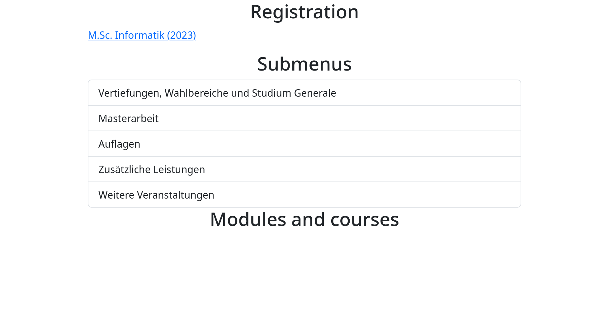

# tucant

## tucant-extension

The Campus-Management System of TU Darmstadt called TUCaN lacks quality and usability. Therefore this extension adds some quality of life improvements.

* "Veranstaltungen -> Anmeldung" caches pages so repeatedly navigating to the same page is extremely fast and automatically descends into menus with only one entry. It's UI looks the following way:
  
  
* TUCaN sometimes chains redirects. In some known places the intermediate redirect is skipped by the extension to speed up the navigation. Furthermore, there are some pages that wait for 500 milliseconds before redirecting. These pages are also skipped at some known places.
* The URL contains your session ID. Therefore sharing URLs with others does not work. The extension automatically changes the session ID in the url to your session ID so sharing URLs works for users of the extension.
* An experimental mobile first design can be activated.

### Installation

Go to https://tucant.github.io/tucant/ and follow the instructions.

### Building extension

```bash
podman build --output . .
```
This will produce a tucant-extension.zip in the current working directory.

### Packaging

#### Chromium

https://developer.chrome.com/docs/extensions/how-to/distribute/host-on-linux#packaging

Open Chromium -> chrome://extensions/ -> Pack extension -> Choose folder -> Pack. Store private key in a secure place

```bash
chromium --pack-extension=tucant-extension --pack-extension-key=/path/to/tucant-extension.pem
```

#### Firefox

https://extensionworkshop.com/documentation/publish/distribute-sideloading/

ZIP the extension files.

Upload to AMO as unlisted extension and pray that it gets signed quickly.

### How does it work

This software consists of the tucan-connector component that extracts information from the html of [TUCaN](https://www.tucan.tu-darmstadt.de) and provides it as a nicer to use programming API. The tucan-injector component can then be used to show that data with a nicer UI that is written using the Rust frontend library [Yew](https://yew.rs/) and that is compiled to [WebAssembly](https://webassembly.org/). This WebAssembly can be injected into the actual TUCaN website using an extension. Then, some pages provide an overlay with the information in a nicer format and caching.

## tucan-connector

### Coverage

```
# https://doc.rust-lang.org/rustc/instrument-coverage.html#test-coverage
cd tucan-connector
RUSTFLAGS="-C instrument-coverage" cargo test
nix shell nixpkgs#llvmPackages_19.bintools-unwrapped
llvm-profdata merge *.profraw -o default.profdata

llvm-cov show -Xdemangler=/home/moritz/.cargo/bin/rustfilt /home/moritz/Documents/tucant/target/debug/deps/tucan_connector-90eac6df256ec2c3 \
    -format=html \
    -output-dir=target/coverage \
    -instr-profile=default.profdata \
    -show-line-counts-or-regions \
    -show-instantiations

xdg-open target/coverage/index.html 
```