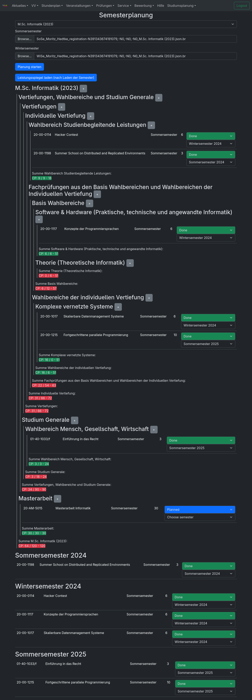
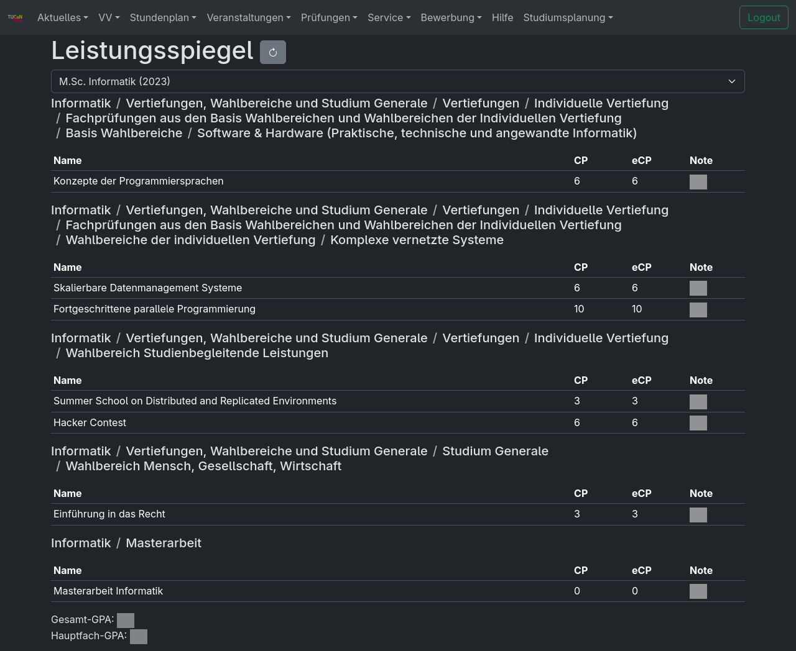

# TUCaN Plus


## Features

### Semesterplanung



### Custom UI



### Shareable URLs

TUCaN URLs are automatically fixed so you can open URLs shared by others.

## Installation

Go to https://tucan-plus.github.io/tucan-plus/ and follow the instructions.

## Development

Requirements: [Rustup](https://www.rust-lang.org/tools/install)

Recommended: VSCodium with rust-analyzer extension

Just open the project in VSCodium.

### Running all tests

```
cargo test
```

### Running UI tests

**Important: Do NOT run in `nix develop` environment**

```
nix run .#test-dev
```

### Formatting

We use a fork of rustfmt to format our custom html extractor macro.
```
# install minimal profile
rustup toolchain install nightly-2025-09-08 --component rust-src --component rustc-dev --component llvm-tools-preview
rustup component remove --toolchain nightly-2025-09-08 rustfmt
cargo +nightly-2025-09-08 install --force --git https://github.com/tucan-plus/rustfmt --branch html-extractor-formatting rustfmt-nightly
cargo +nightly-2025-09-08 fmt
rustup run nightly-2025-09-08 dx fmt

rustup toolchain install nightly-2025-09-08 --component rustfmt
```

### Running as local webserver

```bash
cargo install --git https://github.com/mohe2015/dioxus --branch my dioxus-cli

cd crates/tucan-plus-dioxus/
dx serve --platform web --features api --verbose

cargo install wasm-bindgen-cli@0.2.101

dx serve --wasm --bundle web --base-path /assets/worker # --hot-patch this lets everything explode with "env" imports and sqlite import stuff broken
cp -r ../tucan-plus-worker/target/dx/tucan-plus-worker/debug/web/public/. assets/worker/

# in second tab
cargo install --locked bacon
cd crates/tucan-plus-api/
bacon run

# http://localhost:8080/#/
```

### Developing the extension

```
cd crates/tucan-plus-dioxus/
dx bundle --platform web --out-dir ../../tucan-plus-extension/ --base-path public --features direct --release
```

Go to Firefox Extensions, click settings, debug addons. Then click load temporary add-on and select ./tucan-plus-extension/manifest.json
See https://extensionworkshop.com/documentation/develop/debugging/.

## Building extension (not for development)

```bash
podman build --output . .
```
This will produce a tucan-plus-extension.zip in the current working directory.

## Packaging

### Chromium

https://developer.chrome.com/docs/extensions/how-to/distribute/host-on-linux#packaging

Open Chromium -> chrome://extensions/ -> Pack extension -> Choose folder -> Pack. Store private key in a secure place

```bash
chromium --pack-extension=tucan-plus-extension --pack-extension-key=/path/to/tucan-plus-extension.pem
```

### Firefox

https://extensionworkshop.com/documentation/publish/distribute-sideloading/

ZIP the extension files.

Upload to AMO as unlisted extension and pray that it gets signed quickly.

## How does it work

This software consists of the tucan-connector component that extracts information from the html of [TUCaN](https://www.tucan.tu-darmstadt.de) and provides it as a nicer to use programming API. The tucan-injector component can then be used to show that data with a nicer UI that is written using the Rust frontend library [Dioxus](https://dioxus.dev/) and that is compiled to [WebAssembly](https://webassembly.org/). This WebAssembly can be injected into the actual TUCaN website using an extension. Then, some pages provide an overlay with the information in a nicer format and caching.

## API

```
bacon tucan-plus-api
```
http://localhost:3000/swagger-ui/

http://localhost:3000/api-docs/openapi.json

```
cargo run --bin schema > schema.json
```
https://editor-next.swagger.io/

## tucan-connector

.env
```
TUCAN_USERNAME=
TUCAN_PASSWORD=
SESSION_ID=
SESSION_KEY=
```

## Debugging

https://chromewebstore.google.com/detail/cc++-devtools-support-dwa/pdcpmagijalfljmkmjngeonclgbbannb

## Coverage

```
# https://doc.rust-lang.org/rustc/instrument-coverage.html#test-coverage
cd tucan-connector
RUSTFLAGS="-C instrument-coverage" cargo test
nix shell nixpkgs#llvmPackages_19.bintools-unwrapped
llvm-profdata merge *.profraw -o default.profdata

llvm-cov show -Xdemangler=/home/moritz/.cargo/bin/rustfilt /home/moritz/Documents/tucan-plus/target/debug/deps/tucan_connector-90eac6df256ec2c3 \
    -format=html \
    -output-dir=target/coverage \
    -instr-profile=default.profdata \
    -show-line-counts-or-regions \
    -show-instantiations

xdg-open target/coverage/index.html 
```

## Android

```
sudo systemctl stop firewalld.service
adb connect 172.18.61.176:43109
adb uninstall com.example.TucanPlusDioxus
dx serve --device --platform android --hotpatch --verbose

adb logcat -c
adb shell run-as com.example.TucanPlusDioxus logcat

dx bundle --platform android --device
/home/moritz/Documents/tucan-plus/target/dx/tucan-plus-dioxus/debug/android/app/app/build/outputs/apk/debug/app-debug.apk

dx serve --platform android --hotpatch --verbose
cargo run --manifest-path /home/moritz/Documents/dioxus/packages/cli/Cargo.toml serve --platform android --verbose
# grep for RustStdoutStderr

dx bundle --platform android --release
adb install target/dx/tucan-plus-dioxus/release/android/app/app/build/outputs/apk/release/app-release.apk


cargo run --manifest-path /home/moritz/Documents/dioxus/packages/cli/Cargo.toml build --platform android
```

## Linux

```
dx serve --platform linux --hotpatch --verbose

```

```

cat *_registration-N383703888296780\,-N0\,-N0\,-N0_B.Sc.\ Informatik\ \(2015\).json | jq 'sort_by(.path) | del(.[].studiumsauswahl) | del(.[].entries.[].module.registration_state) | del(.[].entries.[].courses.[].[1].registration_button_link) | del(.[].entries.[].courses.[].[1].location_or_additional_info) | del(.[].entries.[].courses.[].[1].limit_and_size)' > a
cat *_registration-N376333755785484\,-N0\,-N0\,-N0_B.Sc.\ Informatik\ \(2015\).json | jq 'sort_by(.path) | del(.[].studiumsauswahl) | del(.[].entries.[].module.registration_state) | del(.[].entries.[].courses.[].[1].registration_button_link) | del(.[].entries.[].courses.[].[1].location_or_additional_info) | del(.[].entries.[].courses.[].[1].limit_and_size)' | sed 's/N376333755785484/N383703888296780/g' > b
meld a b

oh no there are different numbers for the same PO (probably for each semester?) maybe because depending on your starting semester the modules change?

seems like if you already completed a module it will not show up in registration at the other possible paths any more
also it seems like it won't show new courses etc? probably as you are only allowed to do it once?

seems like your wahlbereiche will be reduced to 3 if you complete your bachelor


inkscape -w 512 ../crates/tucan-plus-dioxus/assets/logo.svg -o logo.png
```